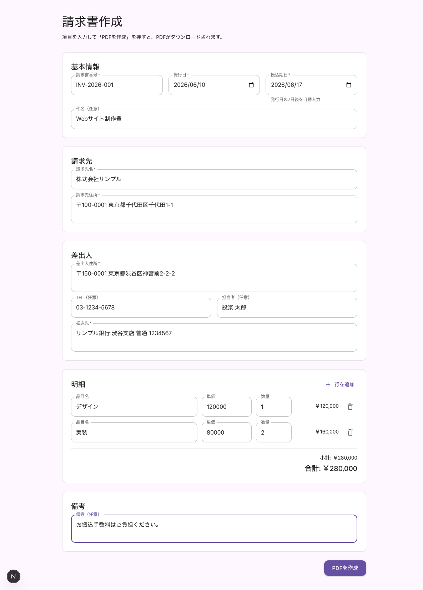
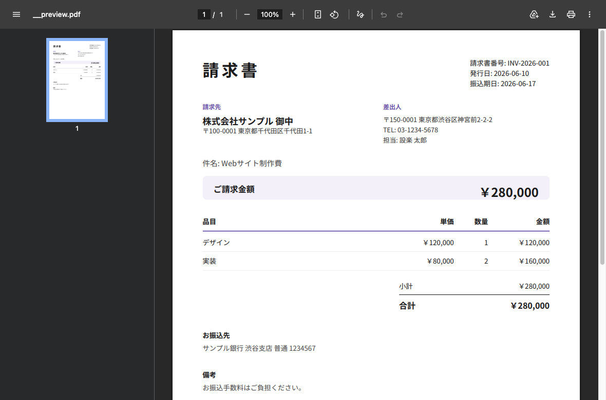

# invoice-automation

入力 → PDF生成 → ダウンロード まで完結する、シンプルな請求書作成 Web アプリ（個人・副業利用想定）。

保存・認証・DB を持たず、ブラウザ内で PDF を生成してダウンロードするだけの構成です。サーバー不要なので **GitHub Pages（静的ホスティング）でそのまま動きます**。

**公開URL**: https://shidara.github.io/invoice-automation/

## スクリーンショット

| 入力フォーム | 生成されるPDF |
| --- | --- |
|  |  |

## Demo

https://shidara.github.io/invoice-automation/

## 特徴

- 請求情報を入力するだけで A4縦の請求書 PDF を生成・ダウンロード
- 小計・合計をリアルタイム計算、明細行は自由に追加・削除
- 振込期日は発行日の7日後を自動入力（手動修正可）
- 日本語フォント（Noto Sans JP）を同梱、PDF はブラウザ内で生成（サーバー不要）
- 入力バリデーション付き（必須項目・日付形式・明細チェック）

## 技術スタック

- **Next.js（App Router）** / **TypeScript** … 静的エクスポート（`output: 'export'`）
- **React 19**
- **Material UI（MUI）** — Material Design 3 ベースのテーマ
- **Storybook** — コンポーネント開発・確認用
- **@react-pdf/renderer** — PDF生成（ブラウザ内で Blob 化）
- パッケージマネージャ: **yarn**

## 入力項目

| 区分 | 項目 | 必須 |
| --- | --- | --- |
| 基本情報 | 請求書番号 / 発行日 | 必須 |
| 基本情報 | 振込期日（発行日+7日を自動入力） | 必須 |
| 基本情報 | 件名 | 任意 |
| 請求先 | 請求先名 / 請求先住所 | 必須 |
| 差出人 | 差出人住所 / 振込先 | 必須 |
| 差出人 | TEL / 担当者 | 任意 |
| 明細 | 品目名 / 単価 / 数量（1件以上） | 必須 |
| 備考 | 備考 | 任意 |

## ディレクトリ構成

```
app/                画面（page.tsx）・ルートレイアウト
features/invoice/   請求書ドメイン
  ├─ types.ts            Invoice / InvoiceItem 型・ファクトリ
  ├─ calc.ts             小計・合計の計算（純関数）
  ├─ validation.ts       入力バリデーション（純関数）
  ├─ InvoiceForm.tsx     入力フォーム（MUI）
  ├─ InvoicePdf.tsx      PDFレイアウト（react-pdf）
  └─ downloadInvoicePdf.ts  生成→ダウンロード（UI側）
components/          共通UI（必要になったら追加）
lib/                共通処理
  ├─ theme.ts            MUIテーマ（MD3ベース）
  ├─ format.ts           金額フォーマット
  ├─ date.ts             日付ユーティリティ
  └─ pdf/createInvoicePdfBlob.tsx  フォント登録＋PDF Blob生成
stories/            Storybook
styles/             最小限のCSS
docs/               ドキュメント・画像
public/             静的アセット（fonts 同梱）
```

## セットアップ

```bash
yarn install
yarn dev          # http://localhost:3000
yarn storybook    # http://localhost:6006
```

## スクリプト

| コマンド | 内容 |
| --- | --- |
| `yarn dev` | 開発サーバー起動 |
| `yarn build` | 静的ビルド（`out/` に出力） |
| `yarn storybook` | Storybook 起動 |
| `yarn build-storybook` | Storybook ビルド |
| `yarn lint` | ESLint |

## PDF生成の仕組み

責務を分割し、PDF実装の差し替え余地を残しつつ過剰抽象化はしていません。

- `features/invoice/InvoicePdf.tsx` … PDFレイアウト（A4縦）
- `lib/pdf/createInvoicePdfBlob.tsx` … フォント登録＋PDF Blob生成
- `features/invoice/downloadInvoicePdf.ts` … UI側のダウンロード（`invoice-{invoiceNumber}.pdf`）

PDF はブラウザ内で生成するため、サーバーや API は不要です。1ページに収まらない明細は自然改ページします。日本語フォントは Noto Sans JP（OFL）を `public/fonts/` に同梱しています（`public/fonts/NOTICE.txt` 参照）。

## デプロイ（GitHub Pages）

`master` への push で `.github/workflows/deploy.yml` が静的エクスポートして Pages に公開します。

初回のみ、リポジトリの **Settings → Pages → Source** を **「GitHub Actions」** に設定してください（Pages サイトの作成が必要なため）。

- 公開URL: `https://shidara.github.io/invoice-automation/`
- `basePath` はビルド時に `GITHUB_PAGES=true` のときだけ `/invoice-automation` を付与（ローカルは素のルート）

## 制約・やらないこと（現時点）

- 保存しない（生成→ダウンロードのみ）。履歴・DB・認証・ストレージ・メール送信なし
- 消費税の計算は未対応（合計＝小計）
- 日本語フォント同梱のためリポジトリに約9MBのフォントを含む
- 将来的に LINE Mini App（LIFF）対応を想定（現状は通常の Web アプリ）

## ライセンス

同梱フォント Noto Sans JP は SIL Open Font License 1.1（`public/fonts/NOTICE.txt`）。
